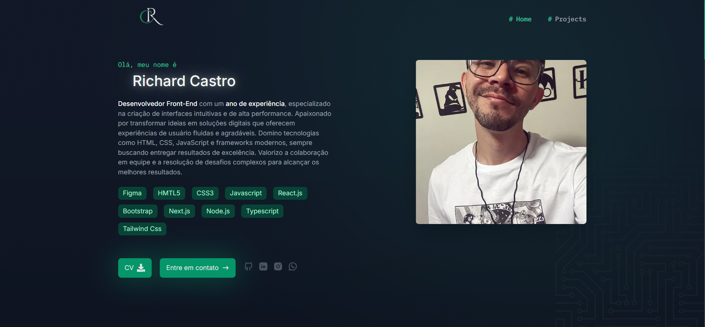
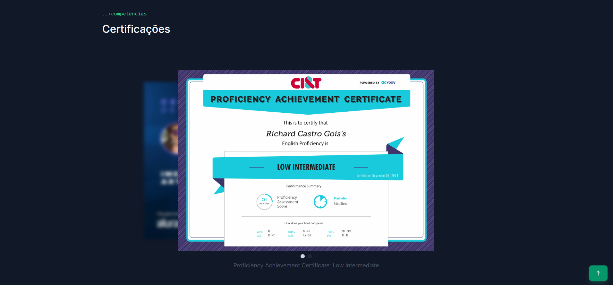
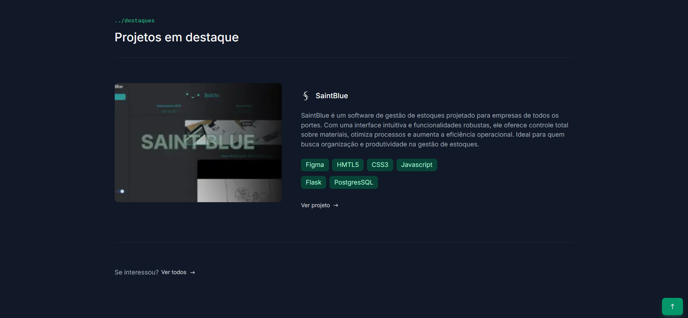
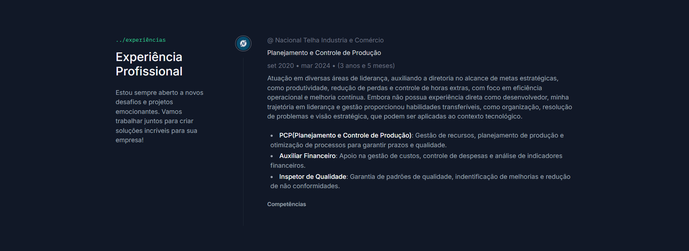
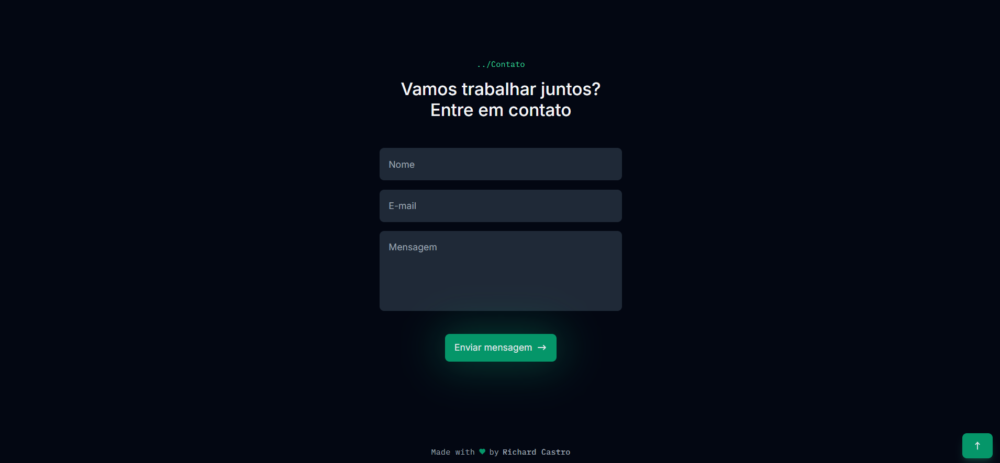

# 🏆 Meu Portfólio Profissional
<br>


Bem-vindo ao repositório do meu portfólio digital !  
Este site foi criado com o objetivo de apresentar minhas experiências, certificações e projetos, funcionando como um currículo interativo para demonstrar minhas habilidades e conquistas na área de desenvolvimento web. O objetivo é demonstrar minha trajetória e competências de forma clara e visualmente atraente.
<br><br>

## 🎯 Objetivo

Este portfólio foi desenvolvido para:

- Mostrar minha experiência profissional de forma dinâmica e interativa.

- Exibir certificações e cursos que completei.

- Apresentar projetos que desenvolvi, com detalhes técnicos e links para demonstrações ou repositórios.

- Servir como um currículo digital acessível a qualquer momento, de qualquer lugar.  
<br><br>

## 🚀 Tecnologias Utilizadas

Este portfólio foi desenvolvido utilizando as mais recentes tecnologias do ecossistema web:

- *Next.js*  - Framework React para construção de aplicações web modernas e performáticas.
- *Tailwind CSS* - Framework CSS utilitário para estilização rápida e responsiva.
- *Framer Motion* - Biblioteca para animações e interações fluidas.
- *TypeScript* - Adiciona tipagem estática ao JavaScript, melhorando a qualidade e a manutenção do código.
- *Hygraph CMS* - CMS (Content Management System) para gerenciar o conteúdo do portfólio de forma dinâmica.
<br><br>

## 📌 Funcionalidades

- 🔹 *Página Inicial*: Apresentação pessoal e resumo profissional.
- 📜 *Projetos*: Galeria de projetos desenvolvidos, com tecnologias utilizadas, descrição e links para visualização.
- 🎓 *Certificações*: Lista de certificados e cursos, com imagens e links para verificação.
- 💼 *Experiência*: Detalhes sobre minha trajetória profissional, com descrição de cargos, responsabilidades e conquistas.  
- 📬 *Contato*: Formulário ou links para entrar em contato comigo.
- 📱 *Layout responsivo* para uma experiência otimizada em qualquer dispositivo.
<br><br>

## 📂 Estrutura do Projeto  
  
O projeto está organizado da seguinte forma:  
````seu-repositorio/
├── public/              # Arquivos estáticos (imagens, ícones, etc.)
├── src/
│   ├── components/      # Componentes reutilizáveis
│   ├── pages/           # Páginas do site
│   ├── styles/          # Estilos globais e do Tailwind
│   └── utils/           # Funções utilitárias
├── README.md            # Este arquivo
└── package.json         # Dependências do projeto
````
<br><br>

## 🌐 Acesse o Portfólio

Você pode acessar o portfólio online através do link:  
🔗 <a href="https://devrichard-portfolio.vercel.app/" target="_blank">Meu Portfólio Online</a>
<br><br><br><br>  


## 🖥 Project Images  
  
  
  
  
  
  
  

## 📝 Como Executar Localmente
Se você deseja rodar o projeto localmente, siga os passos abaixo:

### Clone o repositório:
````bash
git clone https://github.com/richardcastrogois/portfolio.git
````
### Instale as dependências:
````bash
cd <nome-da-pasta-do-repositorio>
yarn install
````

### Inicie o servidor de desenvolvimento:
````bash
yarn dev
````

### Acesse o projeto no navegador:

http://localhost:3000

<br><br>

## 📬 Contato

Se quiser entrar em contato para oportunidades ou colaborações, me encontre em:

📧 Email: [dev.richardgois@gmail.com](mailto\:dev.richardgois@gmail.com)\
💼 LinkedIn: [Richard Castro](https://www.linkedin.com/in/richard-castro-00a6b42bb/)\
🐙 GitHub: [richardcastrogois](https://github.com/richardcastrogois)

---
<br><br>

Desenvolvido com 💙 e dedicação!